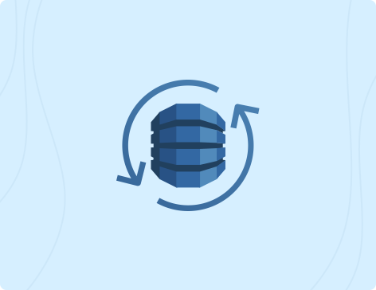

  
  

    <h1 align="left">Offices and Employees</h1>
  

  

    Write a multi-tenant backend for a SAAS ERP solution which allows storage/retrieval/manipulation of offices and employee data. Employees can work in multiple     offices and each office can have multiple employees.
  

  ___

  

    <h4>
      Expert teams of digital product strategists, developers, and designers.
    </h4>
  

  

    
    
  

  ___

  We’re always looking for people who value their work, so come and join us. <a href="https://www.wednesday.is/hiring">We are hiring!</a>

## AppSync

Use AppSync to expose a graphql compliant backend that provides
- a mutation to add/update an office
- a mutation to add/update an employee
- a mutation to associate employees and offices
- a query to fetch all offices
- a query to fetch an office by ID and all its employees
- a query to fetch all employees
- a query to fetch an employee by ID and all the offices the employee works in

